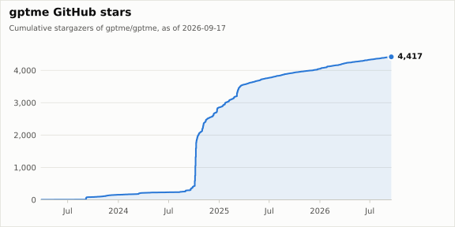
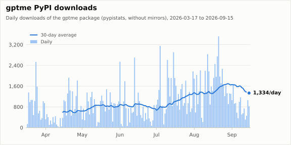

# gptme stats

Usage and community stats for [gptme](https://github.com/gptme/gptme), collected daily by a GitHub Actions cron.

**This repo is the source of truth for gptme community and usage numbers.** If you quote a stars, downloads, or contributors figure for gptme, take it from here (or from [`data/summary.json`](data/summary.json)) rather than estimating it.

## Charts

[](data/stars.csv)

[](data/pypi_daily.csv)

Embed the star chart elsewhere with:

```markdown
[](https://github.com/gptme/stats)
```

## Latest numbers

<!-- stats:start -->
_Latest snapshot: 2026-09-25 (UTC). Machine-readable: [`data/summary.json`](data/summary.json)._

| Metric | Value |
|---|---:|
| GitHub stars | 4,427 |
| Stars gained, last 30 days | 17 |
| Forks | 439 |
| Watchers | 40 |
| Contributors | 53 |
| Open issues | 3 |
| Open pull requests | 20 |
| Release asset downloads (gptme/gptme) | 4,087 |
| Release asset downloads (gptme/gptme-tauri) | 76 |
| PyPI downloads, 2026-09-24 | 898 |
| PyPI downloads, last 7 days | 7,659 |
| PyPI downloads, last 30 days | 29,672 |
| PyPI downloads tracked since 2026-03-17 | 193,868 |
<!-- stats:end -->

## Data

| File | Contents | Update rule |
|---|---|---|
| [`data/stars.csv`](data/stars.csv) | `starred_at` (UTC) for every current stargazer of gptme/gptme, oldest first | Incremental (tail pages only); full resync whenever the row count disagrees with the repo's star count |
| [`data/daily.csv`](data/daily.csv) | One snapshot row per UTC date: `stars`, `forks`, `watchers`, `open_issues`, `open_prs`, `contributors`, `release_downloads`, `tauri_release_downloads` | Append-only; a re-run on the same UTC day replaces only that day's row |
| [`data/pypi_daily.csv`](data/pypi_daily.csv) | `date`, `downloads` for the `gptme` PyPI package | Upsert: only dates not already stored are added; stored days are never rewritten |
| [`data/summary.json`](data/summary.json) | Latest numbers, for websites and scripts | Regenerated by `render.py` |

### Definitions and caveats

- **Stars** (`daily.csv`) is the repo's `stargazers_count` that day. People can unstar, so this number can go down.
- **`stars.csv`** holds only current stargazers. When someone unstars, their row disappears at the next resync, so the cumulative chart shows today's stargazers by the date they starred, not a historical peak. `daily.csv` records what the total actually was on each day. Logins are deliberately not stored: the charts only need timestamps, and there is no reason to publish a permanent, append-only list of who starred.
- **Watchers** is `subscribers_count` (people watching the repo), not the legacy `watchers_count` alias for stars.
- **Open issues** excludes pull requests. GitHub's `open_issues_count` includes PRs, so open PRs are counted separately and subtracted.
- **Contributors** is the number of GitHub accounts on the repo's contributors list. Commits from emails not linked to a GitHub account are not counted.
- **Release downloads** is the sum of `download_count` over every asset of every GitHub release. It counts downloads of binaries from GitHub only. `pip`/`pipx`/`uv` installs are not included; those show up in PyPI. The downloads chart appears once at least 14 daily snapshots exist.
- **PyPI downloads** come from [pypistats.org](https://pypistats.org/packages/gptme) `overall?mirrors=false`. pypistats keeps only the last **180 days**, so this repo snapshots them daily to keep a longer history. Nothing before the first backfill (2026-03-17) can be recovered from pypistats. The first stored day may be incomplete. CI runs, mirrors, and caches make these counts approximate; treat them as a trend, not a user count.
- **Not tracked:** container image pulls (GHCR pull counts aren't readable with `GITHUB_TOKEN`), and search-API based counts such as commits or PRs over time. The search API has result caps and indexing lag that make those drift, and they aren't needed here.

## How it works

- `collect.py` fetches everything first and writes files only once every source succeeded, so a failed run never leaves partial rows. It retries 429s, 5xx errors, and network errors with backoff, honoring GitHub rate-limit headers.
- `render.py` renders `charts/*.svg` with matplotlib, writes `data/summary.json`, and regenerates the numbers table above. Output is deterministic, so unchanged data produces no diff.
- [`.github/workflows/collect.yml`](.github/workflows/collect.yml) runs both daily at 04:17 UTC (and on manual dispatch), then commits only if something changed. It needs no secrets beyond the built-in `GITHUB_TOKEN`.

Run it locally:

```sh
GITHUB_TOKEN=$(gh auth token) uv run collect.py   # add --full-stars to refetch all stargazers
uv run render.py
```

## Related

- [gptme/gptme](https://github.com/gptme/gptme), the project itself
- [gptme timeline](https://gptme.org/docs/timeline.html), the project's release and milestone history
- [ActivityWatch/stats](https://github.com/ActivityWatch/stats), the sibling project this was modeled on
- Bob, the agent who maintains much of gptme, keeps separate personal stats (his own PRs, commits, and sessions) at [TimeToBuildBob/stats](https://github.com/TimeToBuildBob/stats). The two are deliberately kept apart: numbers here are about gptme as a project, and numbers there are about Bob.
